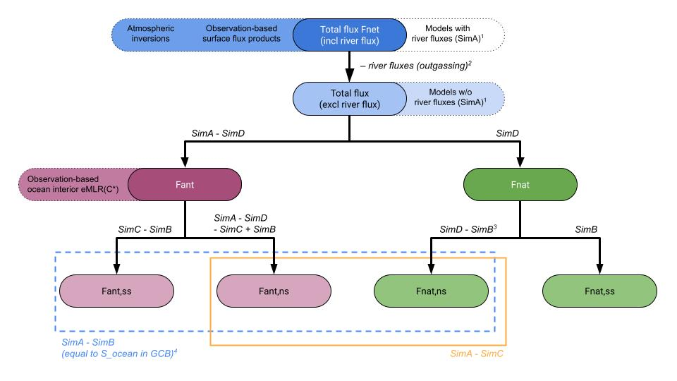

Model and data product analysis and intercomparison within RECCAP2-ocean are facilitated by adapting a set of common procedures laid out in our glossary.  

The latest clean version of our glossary can be found [here](documents/Glossary_RECCAP2-ocean_v20220630.pdf){:target="_blank"}.

