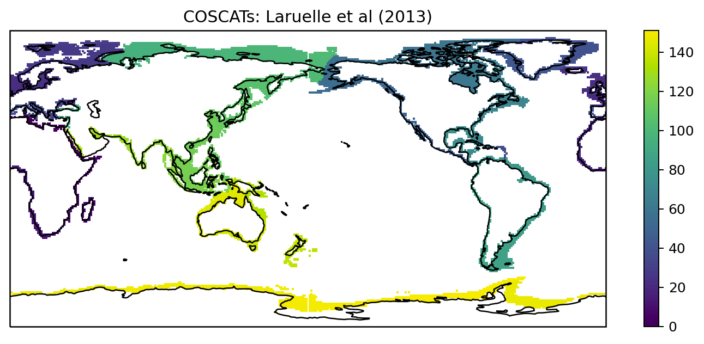

---
---

# Additional resources

## Definition of ocean regions

For the assessment and intercomparison of several data products, globally available results will be split into ocean regions. The discussion about most suitable region boundaries is ongoing on [slack](https://reccapv2.slack.com/archives/C016FLKKPC2){:target="_blank"}.  

The latest considerations for ocean regions and the coastal zone are shown below.

Comment on the boundary definition from Luke Gregor:  
*The boundaries are defined in one of three ways: CO2 biomes by Fay and McKinley (2014) (FM14); the WOA (2009) ocean basin map (WOA09) a link to the data; manual decisions. The WOA mask might not be well known, but this doesn’t matter as it serves purely as a convenient way to define the borders.  
Starting from the simplest, the Southern Ocean is defined by FM14. The eastern boundary of the Indian is defined by the WOA09 boundary between the Pacific and Indian. The Red Sea and the Persian Gulf have been masked. The authors of the Indian Ocean chapter can include this if they wish but of course this should not be a priority for the chapter. In the North Pacific, the Bearring Strait limit is also defined by WOA09. The Atlantic includes the Mediterranean Sea and Gulf of Mexico. W e have chosen to exclude the Baltic Sea as carbon cycling and fluxes are notoriously difficult to predict in the region. The boundary between the Arctic and the Atlantic is defined by FM14 with some modifications. The northern boundary has manually been set to 56°N that limits the extent of FM14's biome in the Labrador Sea. In the far North Atlantic, the eastern extent has been set to 25°E as the most northern extent of Scandinavia.*

A shape file with region boundaries will be made available in this [Github repo](https://github.com/RECCAP2-ocean/shared-resources/tree/master/regions){:target="_blank"}.

## Data policy

RECCAP2-ocean authors have agreed upon shared principles with respect to data policy, which can be found [here](documents/DATA_POLICY_RECCAP2-ocean.pdf){:target="_blank"}.
