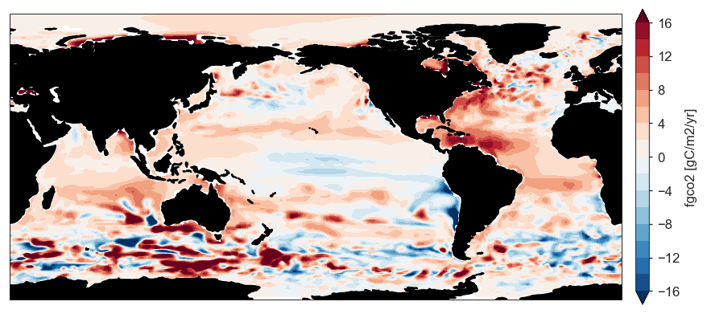

## River fluxes

This is where you can get info about the river fluxes. 

More info about the river fluxes here. 

The data has been adapted to match the RECCAP2-ocean protocol. 

Link to the river flux data: https://github.com/RECCAP2-ocean/RECCAP2-shared-resources/raw/master/data/fgco2_lacroix-river_v20211223.nc

