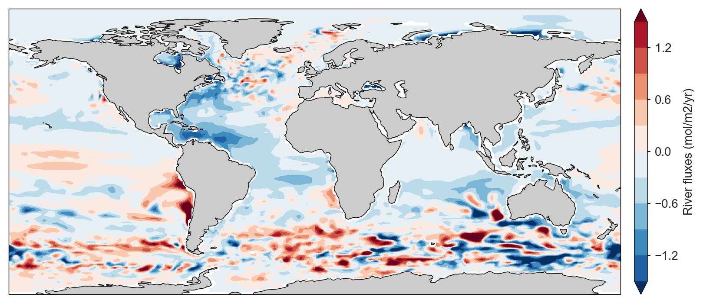

## River fluxes

Air-sea fluxes of riverine carbon from [Lacroix et al. (2020)](https://doi.org/10.5194/bg-17-55-2020) have been scaled to match the mean global value of 0.65 PgC/yr. This scaling value is from [Regnier et al. (2022)](https://doi.org/10.1038/s41586-021-04339-9).

Link to the scaled river flux data: [https://github.com/RECCAP2-ocean/R2-shared-resources/raw/master/data/fgco2_lacroix-river_v20220615.nc](https://github.com/RECCAP2-ocean/R2-shared-resources/raw/master/data/fgco2_lacroix-river_v20220615.nc)

We have integrated the fluxes over the basin level and provide these in the netCDF file.  
**We do not reccomend that the river flux adjustment is used at a sub-biome level.**

